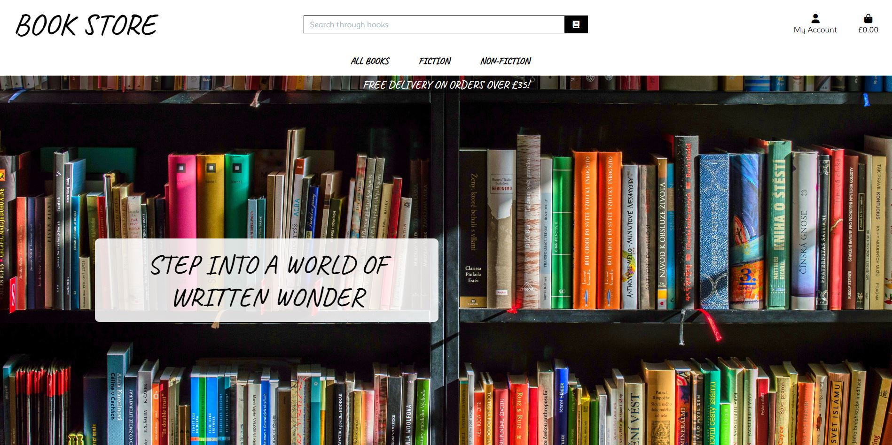
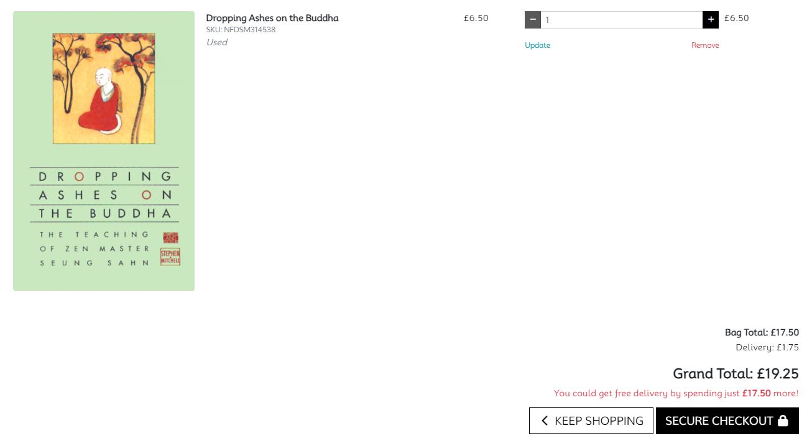

***Disclaimer***:
Unfortunatley my real life job has been quite chaotic recently and I was unable to spend the time required to fully grasp the concepts that are here put forward. I started a project that got quite far along but the code got messy and I was unable to make it work in the end and had to scrap it. Short on time I now put forward a project that I can not call truly my own. I have however managed to learn a little bit more of Django and come to a realization that being a full stack developer is probably not my path here in life. I have learnt a lot about what I personally enjoy and gained a lot of insight into the world of programming. I have found it much more interesting and enjoyable to write backend code. I do not belive the following project meets the satisfactory criterea of assesment but I have tried through my circumstances non the less because advice and criticism is always welcomed. Without furthur ado i present:

# Book Store

Book Store is an online store where people can browse and purchase new and used books. 

The site can be accessed at:

[https://book-store-lukarid-9168f1b715ae.herokuapp.com/](https://book-store-lukarid-9168f1b715ae.herokuapp.com/)

# User Experience Design

## The Strategy Plane
---

### Site Goals
The goal of the site is so that the owner can sell new and used books to customers from around the globe. The site should provide easy and quick ways to organise the meterial presented for the consumer so they may find what they are looking for with ease. For regular customers who wish to purchase books on a regular basis a profile page is provided where personal information is stored quick and convenient checkouts. A personal purchase history is also provided so registered customers may view their previous orders at any time. 

### Agile Planning
The development of an ecommerce website requires an organized and efficient approach. Agile methodology provides a flexible and iterative framework that promotes collaboration, adaptability, and continuous improvement. Here is an overview of the Agile plan for creating this recipe sharing website.

The first sprint, "Project Setup," focuses on establishing the project foundation. This includes setting up the repository and version control system, defining project goals and user stories, and creating a basic Django project structure. An html layout will be created to display the books using bootstrap.

In the second sprint, "Book Navigation," a system to easily search for books will be implemented. This could be done by searching for specific keywords that match book titles, summaries or authors. The books will be put into specific genres that the customers could easily only display books from a specified genre if desired. The books on display will also have the option to be displayed in order of price, title, genre or new/used. Any book can be clicked so that you are taken to a new page where furthur more detailed information is provided about the selected book.

The third sprint, "Checkout and Payment," will allow users to add/remove books to a shopping bag where a total price will be calculated and the books ready for purchase will be on display. The user is can proceede to an intergrated payment system when when ready and fill in shipping detail.

In the fourth sprint, "User Profile and CRUD," users will be able to create accounts where they can store their personal shipping information and view previous purchases. Site admins will have access to add, delete and update books in the system

In the fifth sprint, "User Experience Enhancements," the focus shifts towards improving the overall user interface and experience. The website's design is refined to be visually appealing and user-friendly. success and error messages will be displayed for actions performed on the site and a small pop up window will be displayed when changes to the bag is made.

The final sprint, "Deployment and Final Touches," involves the deployment of the website on Heroku. The code is modified to work on all screen sizes through media quiries. Extensive testing and bug fixing are conducted to ensure a stable and error-free experience.

#### Epics & User Stories
This project consited of 6 main Epics

1. Project Setup
    - As a developer I need to develop a basic structure and layout so that i can easily navigate and edit the website
    - As a developer I need to create templates for each of the different pages of the website so that I can implement different functionality
    - As a developer i need to create a navigation bar so that other users can navigate the website
    - As a developer I need to create models so that I know what information is going to be displayed and can be edited
    - As a developer I need to connect the website to a database so that all the information thats input into the website can be stored somewhere

2. Book Navigation
    - As a user I can browse different genres so that it is easier to navigate
    - As a user I can select a book to gain a furthur understanding of the contents of the book
    - As a user I can search for books so that its easy to find books related to the search term
    - As a user I can organize the books by price, title, author or used/new
    - As a user I can see a picture of the book cover to grab my attention
    - As a user I can get result for searches with partial/incomplete words so that it makes searching easier

3. Checkout and Payment
    - As a user I can add/delete books to my checkout basket
    - As a user I can view my basket with the total sum and contents I have placed into it
    - As a user I can provide my shipping details
    - As a user I can pay for my books
    - As a developer I can safely store the users shipping information
    - As a developer I can recive the users payment for their books

4. User Profile and CRUD
    - As a user I can register and log in to a personal profile
    - As a user I can add my shipping details for faster checkout
    - As a user I can view my previous purchases
    - As a developer i can add, delete and update books on the website

5. User Experience Enhancements
    - As a developer I want the site to be visually pleasing so that people will want to return
    - As a user I am provided with a stable and bug free environment so that I can browse through the website with ease
    - As a user I am provided with regular updates on the the things I am doing

6. Deployment and Final Touches
    - As a user I can use the website on all my electronic devices so that I can access it anywhere I am
    - As a developer I need the website to be available to the public so that people can use it

## The Structure Plane
---
### Features
#### **All Pages**
- *Navigation Bar*

    The navigation bar is located at the top of every page on the websit. It is used to help navigate the website from any page. 

    

    - Logo/Header -> Visual representations of the website and also works as a links back to homepage.
    - Login/Logout -> A button located in the top right hand corner that allows user to navigate to the login page or log out of their current account. Clicking on the icon will allow users to see if they are logged in. Users can also navigate to their peronal profile from this button. If the user is a developeer they can also use this button to navigate to the page to add books.
    - Shopping bag -> A button next to the user profile button at the top right where users have access to their shopping bag.  
    - Search Bar -> The search bar located in the middle at the top of the screen where users can type in search phrases to search for books.
    - Book Access -> Access to books or specific book genres available under the search bar in drop down menus.

- *Toasts*
    Error and success messages are displayed top right for certain actions and post requests.

    

- *Shopping Bag*
    A preview of the shopping bag is displayed in the top right when items are added.

    

#### **Homepage**
- *Redirect to Books*

    On the homepage a button is presented to the user inviting them in to browse the book selection and redirects all the available books. A header is provided informing the user of a free delivery threshold.

    

#### **Book Selection Page**
- *Books and Order*
    
    The number of available books for the selected genre is displayed at the top left under the navigation bar and the a drop down menu to the right shows what kind of order the books are in and can also be used to reorganize the books.

    

- *Individual book boxes*

    All the available books for purchase are displayed in 4 columns.

    

    - The number of available books for selected genre is displayed at the top.
    - The genre of the book each book displayed is stated atthe top of each book.
    - A picture of the book cover is then displayed which when clicked brings the user to the book detail page
    - Followed by a the book title.
    - And then the Author.
    - A tag is then displayed if the book is used.
    - And then the price is displayed at the bottom.
    - If the user is a developer an Edit/Delete option is displayed under the price.

#### **Book Detail Page**

- *Book Details*

    The details of the book is displayed once again with an added summary of the book

- *Add to Bag*

    The user can then select a quantity using the +/- signs or by typin gin a quantity and press the ADD TO BAG button if they want to put the book(s) into their shopping bag. If not a KEEP SHOPPING button is also displayed wich brings the user back to all the books.

- *Edit/Delete* 

    The developers will have the option to edit or delete the book. 

#### **Shopping Bag Page**

- *Book Info*

    Some of the information of the book will be displayed

    - Book cover image
    - Book title
    - SKU code
    - Unit price
    - Quantity with the option to adjust/remove it
    - The subtotal for that specific book

- *Bag Total*

    Information of total and delivery cost will be calculated for the user

    - Bagtotal without delivery cost
    - Delivery cost
    - Grand total
    - Information on how much more is needed to be spent for free shipping
    - A SECURE CHECKOUT button to bring the user to the checkout page

#### **Checkout Page**

- *Order Summary*

    An order summary of items and calculated costs is displayed.

- *Customer details*

    Customer details are then to be provided

    - Full Name
    - Email
    - Phone number
    - Address
    - Town/City
    - Post Code
    - County
    - Country
    - Option to save information
    - Card information
    - A COMPLETE ORDER button with the grand total printed underneath that will process the users payment and order 

#### **Checkout Success Page**

   

 All information is displayed back to the user as well as with an order number and the date of purchase. A KEEP BROWSING BOOKS! button is down the bottom to take users back to the shopping page.
 

#### **Sign Up/Login/Logout Pages**

- *Sign Up*

    The users can create an account with
    - Email Address (Email confirmation needed)
    - Username 
    - Password

- *Login*

    The user can log in with their username and password and request a password recovery email incase password is forgotten.

- *Logout*

    The user is presented with a page witht he options to either signout or cancel.

#### **Book Management Page**

- *Add a New Book*

    If the user is an admin they can access the book management site under their account icon. Here they can add a book with the following information where theones marked with a * are compulsory:
    
    - Genre
    - SKU
    - Title*
    - Author*
    - Summary*
    - Price*
    - Image URL or file
    - Option to marked product as used

- *Edit Book*

    If a user is an admin they can edit a book through one of the edit book buttons scattered around the site. This will bring them back to the exact same layout as the Add Book page only with the information already filled in. Here they can shoose to edit and update the book details.

### Future Features
#### For Users
- User will be able to favourite books that they might want to buy in the future and view them on a seperate page.
- Users will be able to leave comments under the book details page where they can voice what they thought of the book.
- A contact page will be added where users can get in touch with site admin.
- Users will be able to pay through paypal.

#### For Developers
- When a book is deleted the developer will be prompted with a confirm window instead of the book being deleted straight away.
- The number of books available for each title can be set , especially usefull for used books.
- A book will be available in both new and used condition under the same book detail page if such option exist.
- More ways to organize and browse books such as: year written, lannguage, length, age rating and new arrivals.

## The Surface Plane
### Design
#### Color Scheme
The color scheme is a simple black to allow focus to be drawn toward the (often beautiful) book covers.
#### Typography
The font 'Caveat' is used for the header elements to give off a human sense of touch, hand crafted like the books they are buying. 
The font 'Mooli' is used for the smaller more important information for an easy read with a soft gentle curve for the eyes.
#### Imagery

Background images was taken from [Pexels](https://www.pexels.com/).
A

# Technologies

- HTML
    The structure of the Website was developed using HTML as the main language.
- CSS
    The Website was styled using custom CSS in an external file.
- JavaScript
    JavaScript was used for 
    - Animation 
    - Country fields
    - Stripe Elements
    - Updating bag quantity
    - Removing item and reload on click
    - Setting image
    - Back to top button
    - Sorting books
    - Toast
- Python
    Python was the main programming language used for the application using the Django Framework.
- PostgreSQL
    The database where all data is stored that is put into the website.
- Stripe
    - Used for the intergrated payment system.
- Allauth
    Used for the authentication methods of users
- GitHub
    Source code is hosted on GitHub
- Git
    Used to commit and push code during the development of the Website
- Font Awesome
    This was used for icons throughout the site
- Heroku
    Hosting the website
- Amazon Web Services
    - Storing files

### External Python Modules
asgiref==3.7.2
boto3==1.28.53
botocore==1.31.53
dj-database-url==0.5.0
Django==3.2.21
django-allauth==0.41.0
django-countries==7.2.1
django-crispy-forms==1.14.0
django-storages==1.14
gunicorn==21.2.0
jmespath==1.0.1
oauthlib==3.2.2
ordereddict==1.1
Pillow==10.0.0
psycopg2==2.9.7
python3-openid==3.2.0
pytz==2023.3.post1
requests-oauthlib==1.3.1
s3transfer==0.6.2
sqlparse==0.4.4
stripe==6.5.0
urllib3==1.26.16

# Testing
## Functionality Testing
The website has been thoroughly tested to see if it work, these include:

- All processed information gets stored in the linked up PostgreSQL database.
- Book organisation works correctly
- Stripe payments get processed succesfully.
- All links are working and take you to the right destination.
- No information can be submitted without the right content and the required fields filled in.
- Anonymous users can make purchase.
- Registered user can store their information and make purchases
- Toasts work correctly
- Email function works for confirming users email

### Lighthouse
The lighthouse report showed decent results with areas of improvement in SEO and accessibility.

### Run Locally

Navigate to the GitHub Repository you want to clone to use locally:

- Click on the code drop down button
- Click on HTTPS
- Copy the repository link to the clipboard
- Open your IDE of choice (git must be installed for the next steps)
- Type git clone copied-git-url into the IDE terminal

The project will now have been cloned on your local machine for use.

### Fork Project

Most commonly, forks are used to either propose changes to someone else's project or to use someone else's project as a starting point for your own idea.

- Navigate to the GitHub Repository you want to fork.

- On the top right of the page under the header, click the fork button.

- This will create a duplicate of the full project in your GitHub Repository.

 